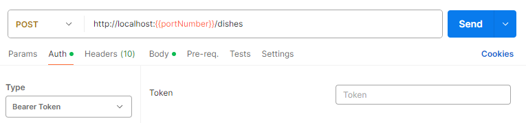
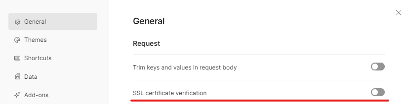

# Examples of different API standards
Complex examples of different types of APIs. This includes:
- [Minimal API](#minimal-api)
- [Basic CRUD API](#basic-crud-api)
- [Restful API](#restful-api)
- [OData API](#odata-api)
- [API with Unit Testing](#unit-testing)

## Minimal API
Inspired by
[Kevin's Dockx](https://app.pluralsight.com/library/courses/asp-dot-net-core-7-building-minimal-apis/table-of-contents)
course from pluralsight.

### Auth
JWT-Bearer Token is used to perform the authorization. To create such a token, use the CLI command inside the 
MinimalAPI project folder:
 `dotnet user-jwts create --audience MinimalAPI`
 The command will create a token with the following parameters:
- audience: **MinimalAPI**
- valid issuer: **dotnet-user-jwts**
- name: **your computer name**

*You can see what's inside the generated token on this [website](https://jwt.io/) or via CLI command:*
 `dotnet user-jwts print <TokenID>`

 

Use the generated token in the request authorization tab or on the Postman collection itself:

The token parameters are checked by the API using the Microsoft JwtBearer package configuration settings, which are 
taken from [appsettings.json "Authentication"](MinimalAPI/appsettings.json).

 

#### Authorization policy
For the `POST /dishes` method you need to have the **admin role** and the claim **country=Germany**:
 `dotnet user-jwts create --audience MinimalAPI --claim country=Germany --role admin`

## Basic CRUD API
API for getting and managing simple information about cities and their points of interest. Inspired by
[Kevin's Dockx](https://app.pluralsight.com/library/courses/asp-dot-net-core-6-web-api-fundamentals/table-of-contents)
course from pluralsight.

**Types of endpoints implemented:**  
&emsp;`get`, `post`, `put`, `patch`, `delete`

**Services used:**
- `JsonPatch` - to process the **patch** endpoint
- `NewtonsoftJson` formatter - to serialize a JsonPatch document
- `FileExtensionContentTypeProvider` - to create a `Content-Type` field for specific files
- `XmlDataContractSerializerFormatters` - output XML serialization
- `Serilog` - for logging into file and console
  - `serilog.sinks.file`
  - `serilog.sinks.console`
- Dummy mail service - custom created
  - different implementations for development and production
  - mail addresses stored in configuration file

## Restful API
Inspired by
[Kevin's Dockx](https://app.pluralsight.com/library/courses/asp-dot-net-core-6-web-api-deep-dive/table-of-contents)
course from pluralsight.

## OData API
Inspired by
[Kevin's Dockx](https://app.pluralsight.com/library/courses/building-consistent-restful-api-odata-v4-asp-dot-net-core/table-of-contents)
course from pluralsight.

## Unit testing
Testing API with xUnit.
Inspired by
[Kevin's Dockx](https://app.pluralsight.com/library/courses/asp-dot-net-core-6-web-api-unit-testing/table-of-contents)
course from pluralsight.

SQLite as Database.

## Postman Collections
If you encounter a certificate issue when submitting a request, disable certificate validation in the settings:
